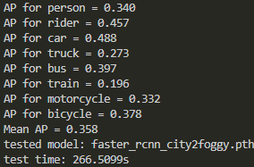
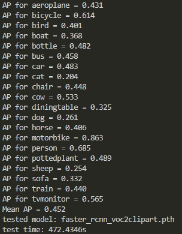
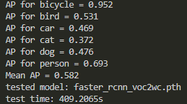
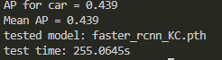

# Trained model

Consider that several researchers were unable to reproduce the experimental results in the paper after training the provided code. In order to prove the authenticity of the paper and the effectiveness of our proposed method, we provide the trained model and test data here.

The teacher model updates parameters at each step (rather than at the end of each epoch), which leads to a much faster learning speed, so our model does not need to train for many epochs (5, 10 or 20) to achieve the best results. Regarding the reproduction of the experimental results, we have the following suggestions: 1. Shorten the training time. We guess that the reason why they cannot reproduce the experimental results is that the training time is too long. The completely unsupervised nature of the SFOD problem (there is even no source domain label to ensure the stability of the model), the low accuracy of the source only model on the four scenarios, and the existence of a large number of False Negatives make the model decline during long time training. 2. Consider to update the teacher model after each epoch to slow down the learning speed of the model.

***WARNING: When running the trained model, be sure to use python 2.7.12 + pytorch 1.0.0 + Cuda 10.0 to reproduce the results. Because we found that when using python3.+, the detection results are inconsistent.***

We use the standard Faster R-CNN as the teacher and student. For PASCAL VOC to Clipart and PASCAL VOC to Watercolor, we use Resnet101 as our backbone. For Cityscapes to Foggy-Cityscapes and KITTI to Cityscape, we use VGG16 (without batchnorm) as our backbone. Note that for the Foggy-Cityscapes dataset, we use the foggy level of 0.02. For Clipart dataset, we use all 1K images for both training and testing.

## Environmet

* **Python 2.7.12**
* **Pytorch 1.0.0**
* **Cuda 10.0**

**Install all the python dependencies using pip:**

```
pip install -r requirements.txt
```

The following is the specific situation of our used environment:

```bash
pip list

Package                            Version             Location                                                                                       
---------------------------------- ------------------- -----------------------------------------------------------------------------------------------------
absl-py                            0.15.0        
astroid                            1.6.6         
attrs                              21.2.0        
autopep8                           1.5.7         
backports-abc                      0.5           
backports.functools-lru-cache      1.6.1         
backports.shutil-get-terminal-size 1.0.0         
bleach                             3.3.1         
cachetools                         3.1.1         
certifi                            2020.6.20     
cffi                               1.14.0        
chardet                            4.0.0         
configparser                       4.0.2         
contextlib2                        0.6.0.post1   
cycler                             0.10.0        
Cython                             0.29.22       
decorator                          4.4.2         
defusedxml                         0.7.1         
easydict                           1.9           
entrypoints                        0.3           
enum34                             1.1.10        
faster-rcnn                        0.1                 /home/lishuaifeng/code/Source-Free-Object-Detection-by-Learning-to-Overlook-Domain-Style/Overlook/lib
functools32                        3.2.3.post2   
futures                            3.3.0         
google-auth                        1.35.0        
google-auth-oauthlib               0.4.1         
grpcio                             1.41.1        
idna                               2.10          
importlib-metadata                 2.1.1         
ipaddress                          1.0.23        
ipykernel                          4.10.1        
ipython                            5.10.0        
ipython-genutils                   0.2.0         
isort                              4.3.21        
Jinja2                             2.11.3        
jsonschema                         3.2.0         
jupyter-client                     5.3.5         
jupyter-core                       4.6.3         
kiwisolver                         1.1.0         
lazy-object-proxy                  1.6.0         
Markdown                           3.1.1         
MarkupSafe                         1.1.1         
matplotlib                         2.2.5         
mccabe                             0.6.1         
mistune                            0.8.4         
mkl-fft                            1.0.15        
mkl-random                         1.1.0         
mkl-service                        2.3.0         
msgpack                            1.0.2         
nbconvert                          5.6.1         
nbformat                           4.4.0         
notebook                           5.7.13        
numpy                              1.16.6        
oauthlib                           3.1.0         
olefile                            0.46          
opencv-python                      4.2.0.32      
packaging                          20.9          
pandocfilters                      1.4.3         
pathlib                            1.0.1         
pathlib2                           2.3.6         
pexpect                            4.8.0         
pickleshare                        0.7.5         
Pillow                             6.0.0         
pip                                19.3.1        
prometheus-client                  0.11.0        
prompt-toolkit                     1.0.18        
protobuf                           3.15.6        
ptyprocess                         0.7.0         
pyasn1                             0.4.8         
pyasn1-modules                     0.2.8         
pycodestyle                        2.7.0         
pycparser                          2.20          
Pygments                           2.5.2         
pylint                             1.9.5         
pyparsing                          2.4.7         
pyrsistent                         0.15.0        
python-dateutil                    2.8.1         
pytz                               2021.1        
PyYAML                             5.4.1         
pyzmq                              19.0.2        
requests                           2.27.1        
requests-oauthlib                  1.3.1         
rope                               0.19.0        
rsa                                4.5           
scandir                            1.10.0        
scikit-learn                       0.20.4        
scipy                              1.2.3         
Send2Trash                         1.8.0         
setuptools                         44.0.0.post20200106 
simplegeneric                      0.8.1         
singledispatch                     3.6.2         
six                                1.15.0        
sklearn                            0.0           
subprocess32                       3.5.4         
tensorboardX                       1.7           
terminado                          0.8.3         
testpath                           0.4.4         
toml                               0.10.2        
torch                              1.0.0         
torchvision                        0.2.2         
tornado                            5.1.1         
tqdm                               4.61.1        
traitlets                          4.3.3         
urllib3                            1.26.9        
wcwidth                            0.2.5         
webencodings                       0.5.1         
Werkzeug                           1.0.1         
wheel                              0.36.2        
wrapt                              1.12.1        
zipp                               1.2.0
```

## Download models and test data

1. Download the `ModelAndData.zip` from [here](https://1drv.ms/u/s!Asa3c2aux4dRb7e7vZKoK7KzIRs?e=RP3sq9)
2. Unzip `ModelAndData.zip`, and put the `models` and `data` folders in the root directory
3. Finally, you will have the following file tree:

```

ROOT
├── cfgs
│   ├── res101_ls.yml
│   ├── res101.yml
│   ├── res50.yml
│   └── vgg16.yml
├── code
│   ├── _init_paths.py
│   ├── lib
│   ├── test.py
│   ├── utils.py
├── data
│   ├── cityscape
│   │   └── VOC2007
│   │       ├── Annotations
│   │       ├── ImageSets
│   │       └── JPEGImages
│   ├── clipart
│   │   └── VOC2007
│   │       ├── Annotations
│   │       ├── ImageSets
│   │       └── JPEGImages
│   └── watercolor
│       └── VOC2007
│           ├── Annotations
│           ├── ImageSets
│           └── JPEGImages
├── models
│   ├── res101
│   │   ├── voc2clipart
│   │   │   └── faster_rcnn_voc2clipart.pth
│   │   └── voc2wc
│   │       └── faster_rcnn_voc2wc.pth
│   └── vgg16
│       ├── city2foggy
│       │   └── faster_rcnn_city2foggy.pth
│       └── KC
│           └── faster_rcnn_KC.pth
├── README.md
├── requirements.txt
├── copydata.ipynb
├── result_images
│   ├── city2foggy.png
│   ├── KC.png
│   ├── voc2clipart.png
│   └── voc2wc.png
└── test.sh
```

## Compilation

**Compile the cuda dependencies using following simple commands:**

```
cd code/lib
python setup.py build develop
```

## Test model

Run the `test.sh` file to test the four scenarios: **Pascal->Clipart, Pascal->Watercolor, Cityscapes->foggy-Cityscapes, KITTI->Cityscapes**

```
bash test.sh
```

## Our result

According to the above steps, we get the following results:

**Cityscapes->foggy-Cityscapes:**



**Pascal->Clipart:**



**Pascal->Watercolor:**



**KITTI->Cityscapes:**


