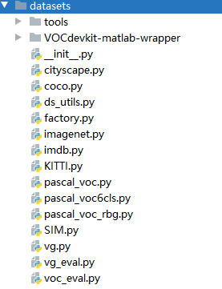
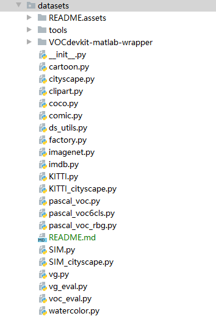
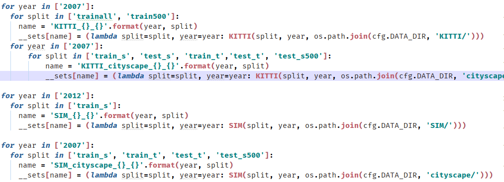

# dataset数据集加载文件夹说明

这里面的东西基本都来自于熊林师兄的文件夹。但是我做了一些修改：

熊林师兄的文件夹如下：

为了在加载数据的时候清楚的打印输出信息，我对这个文件夹做了修改，增加了一些类别。

pascal和pascal6cls这两个都是熊林师兄的，不是我的。**但是这两个文件不一样！**

clipart数据集是从Pascal复制的，watercolor、comic和cartoon是从pascal_voc6cls复制的。

cityscape文件是完全从熊林师兄那里抄过来的，**这个文件和pasca_voc不太一样**。

KITTI_cityscape是CK场景下的cityscape，这个文件是从KITTI抄来的。（从KITTI抄是没问题的，因为熊林师兄代码里面也是用的KITTI这个类别的）

SIM_cityscape是sim2city场景下的cityscape，这个文件是从SIM抄来的。（从SIM抄是没问题的，因为熊林师兄代码里面也是用的SIM这个类别的）

**而KITTI和cityscape文件内容还不一样，SIM和cityscape文件内容也还不一样，SIM和KITTI也不一样。**KITTI和SIM和cityscape都是从熊林师兄那里复制的。